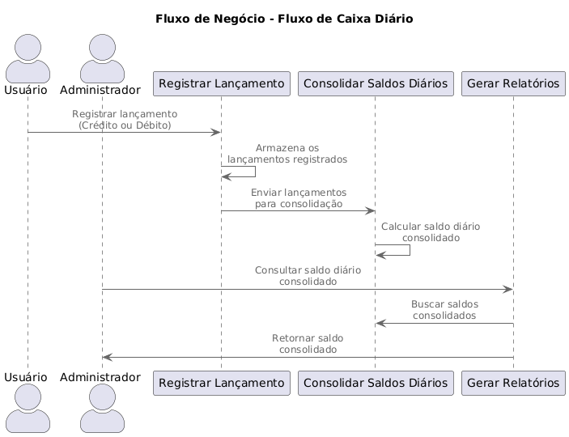

# Fluxo de Caixa Diário - Solução Arquitetural

## 🚨 Aviso

**Este projeto é uma Prova de Conceito (POC).**  
Ele foi desenvolvido apenas para fins de aprendizado e demonstração de conceitos arquiteturais, **não sendo solicitado ou pertencente ao trabalho de nenhuma empresa**, e não é recomendado para uso comercial ou em ambientes produtivos, pois cada empresa possui uma realidade.


---
## Índice
1. [Requisitos de Negócio](#1-requisitos-de-negócio)
2. [Desenho da Solução](#2-desenho-da-solução)
   - [Arquitetura Geral](#arquitetura-geral)
   - [Fluxo de Comunicação](#fluxo-de-comunicação)
   - [Diagrama de Componentes](#diagrama-de-componentes)
3. [ADRs (Arquitetural Decision Records)](#3-adrs-arquitetural-decision-records)
   - [ADR-001: Microsserviços como padrão arquitetural](./docs/adrs/ADR-001-Decisao-Adotar-Microservicos.md)
   - [ADR-002: Separação de Dados Transacional e Analítico](./docs/adrs/ADR-002-Separacao-Dados-Transacional-e-Analitico.md)  
   - [ADR-003: Decisão Sobre Cache Para Relatórios](./docs/adrs/ADR-003-Decisao-Sobre-Cache-Para-Relatorios-Diarios.md)  


4. [Como Executar a Solução](#4-como-executar-a-solução)
   - [Pré-requisitos](#pré-requisitos)
   - [Passo a Passo](#passo-a-passo)
5. [Observações Finais](#observações-finais)

---

## 1. Requisitos de Negócio
### Objetivo
Desenvolver uma solução para o controle de fluxo de caixa de um pequeno comércio, permitindo o registro de lançamentos diários (débitos e créditos) e a geração de relatórios consolidados com o saldo diário.

### Diagrama do fluxo


### Funcionalidades Principais
- **Registro de Lançamentos**:
  - Registrar créditos e débitos com descrição, data e hora.
  - Consultar lançamentos diários ou filtrados por tipo.
- **Consolidado Diário**:
  - Processar automaticamente o saldo diário consolidado no final de cada dia.
  - Garantir alta disponibilidade, mesmo em momentos de pico (até 50 requisições/segundo).
- **Relatórios**:
  - Consultar lançamentos e saldos consolidados via API.
  - Exportar dados financeiros (opcional).

### Requisitos Não-Funcionais
- **Escalabilidade**: Dimensionamento horizontal para atender a alta carga de trabalho.
- **Resiliência**: Capacidade de recuperação de falhas com failover e monitoramento.
- **Segurança**: Implementação de autenticação, autorização e criptografia.
- **Performance**: Uso de cache para relatórios frequentes.
- **Observabilidade**: Monitoramento de métricas e logs em tempo real.

---

## 2. Desenho da Solução

### Arquitetura Geral
A solução utiliza uma arquitetura baseada em microsserviços, com os seguintes componentes principais:

1. **Serviço de Controle de Lançamentos**:
   - API REST para registro e consulta de lançamentos.
   - Banco de dados relacional (Azure SQL).
   - Publicação de eventos no Azure Service Bus.

2. **Serviço de Consolidado Diário**:
   - Worker Service que consome eventos de lançamentos.
   - Cálculo do saldo diário consolidado.
   - Armazenamento dos saldos consolidados em Azure SQL ou Azure Table Storage.

3. **Relatórios**:
   - APIs para consulta de relatórios de lançamentos e saldos consolidados.
   - Cache distribuído (Azure Cache for Redis) para melhorar a performance.

### Fluxo de Comunicação
1. O lançamento é registrado via API e salvo no banco de dados.
2. Um evento é publicado no Azure Service Bus.
3. O Worker Service processa o evento, calcula o saldo diário e atualiza os dados consolidados.

### Diagrama de Componentes
*(Adicione aqui um diagrama de componentes mostrando a interação entre os serviços, o Service Bus e os bancos de dados.)*

---

## 3. ADRs (Arquitetural Decision Records)

### Decisão 1: Microsserviços como padrão arquitetural
- **Contexto**: A separação de responsabilidades entre serviços permite escalabilidade independente.
- **Decisão**: Adotar microsserviços para isolar o controle de lançamentos e o consolidado diário.
- **Justificativa**:
  - Melhor alinhamento com requisitos de escalabilidade e resiliência.
  - Desacoplamento entre registro de lançamentos e processamento de consolidados.
- **Trade-offs**: Aumento da complexidade operacional.

### Decisão 2: Azure Service Bus para comunicação assíncrona
- **Contexto**: O serviço de consolidado diário não pode impactar o registro de lançamentos.
- **Decisão**: Usar o Azure Service Bus para comunicação entre os serviços.
- **Justificativa**:
  - Garantia de entrega de mensagens mesmo em caso de falha temporária de um serviço.
  - Melhor escalabilidade e processamento assíncrono.
- **Trade-offs**: Custo adicional para o uso do Service Bus.

### Decisão 3: Cache para relatórios frequentes
- **Contexto**: Relatórios consolidados são consultados frequentemente.
- **Decisão**: Usar Azure Cache for Redis para armazenar dados frequentemente acessados.
- **Justificativa**:
  - Reduz a carga no banco de dados.
  - Melhora o desempenho das consultas.
- **Trade-offs**: Necessidade de manutenção adicional para sincronizar o cache.

*(Adicione outras ADRs relevantes.)*

---

## 4. Como Executar a Solução

### Pré-requisitos
- **SDK do .NET 8** instalado.
- **Docker** para execução de serviços dependentes.
- **Conta no Azure** com recursos configurados (Service Bus, SQL, Redis).
- **Git** para clonar o repositório.

### Passo a Passo

#### 1. Clonar o Repositório
```bash
git clone https://github.com/seu-usuario/fluxo-caixa-diario.git
cd fluxo-caixa-diario
