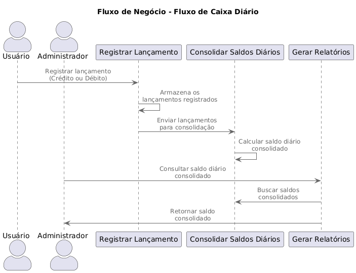

# Fluxo de Caixa Diário - Solução Arquitetural

## 🚨 Aviso

**Este projeto é uma Prova de Conceito (POC).**  
Ele foi desenvolvido apenas para fins de aprendizado e demonstração de conceitos arquiteturais, **não sendo solicitado ou pertencente ao trabalho de nenhuma empresa**, e não é recomendado para uso comercial ou em ambientes produtivos, pois cada empresa possui uma realidade.


---
## Índice
1. [Requisitos de Negócio](#1-requisitos-de-negócio)
2. [Desenho da Solução](#2-desenho-da-solução)
3. [ADRs (Arquitetural Decision Records)](#3-adrs-arquitetural-decision-records)
4. [Como Executar a Solução](#4-como-executar-a-solução)
   - [Pré-requisitos](#pré-requisitos)
   - [Passo a Passo](#passo-a-passo)
5. [Observações Finais](#observações-finais)

---

## 1. Requisitos de Negócio
### Objetivo
Desenvolver uma solução para o controle de fluxo de caixa de um pequeno comércio, permitindo o registro de lançamentos diários (débitos e créditos) e a geração de relatórios consolidados com o saldo diário.

### Diagrama do fluxo


### Funcionalidades Principais
- **Registro de Lançamentos**:
  - Registrar créditos e débitos com descrição, data e hora.
  - Consultar lançamentos diários ou filtrados por tipo.
- **Consolidado Diário**:
  - Processar automaticamente o saldo diário consolidado no final de cada dia.
  - Garantir alta disponibilidade, mesmo em momentos de pico (até 50 requisições/segundo).
- **Relatórios**:
  - Consultar lançamentos e saldos consolidados via API.
  - Exportar dados financeiros (opcional).

### Requisitos Não-Funcionais
- **Escalabilidade**: Dimensionamento horizontal para atender a alta carga de trabalho.
- **Resiliência**: Capacidade de recuperação de falhas com failover e monitoramento.
- **Segurança**: Implementação de autenticação, autorização e criptografia.
- **Performance**: Uso de cache para relatórios frequentes.
- **Observabilidade**: Monitoramento de métricas e logs em tempo real.

---

## 2. Desenho da Solução

O sistema de Fluxo de Caixa Diário foi projetado com base em uma arquitetura escalável e resiliente, utilizando **dados sintéticos e analíticos**. Essa abordagem segue os princípios de separação de responsabilidades e adoção de boas práticas como **CQRS (Command Query Responsibility Segregation)**.


### **Componentes Principais**
O diagrama apresenta os principais componentes e a interação entre eles:

1. **Usuários e Administradores**:
   - **Usuário do Comércio**: Registra lançamentos no fluxo de caixa (créditos e débitos).
   - **Admin do Comércio**: Consulta relatórios consolidados e monitora o sistema.

2. **Camada de Segurança (Firewall e NSG)**:
   - Protege os serviços internos do sistema contra acessos não autorizados.
   - Todas as requisições passam por essa camada antes de acessar os serviços internos.

3. **Serviços Internos**:
   - **Serviço de Controle de Lançamentos (API REST)**:
     - Registra os lançamentos e os persiste no **Banco Transacional (Azure SQL)**.
     - Publica eventos de novos lançamentos no **Azure Service Bus** para comunicação assíncrona.
   - **Serviço de Consolidado Diário (Worker Service)**:
     - Processa eventos de lançamentos enviados pelo **Service Bus**.
     - Calcula os saldos consolidados diários e os armazena no **Banco Analítico (Azure SQL)**.
   - **Serviço de Relatórios (API REST)**:
     - Fornece relatórios com dados analíticos (saldos consolidados) e dados detalhados (lançamentos).
     - Usa o **Redis Cache** para acelerar consultas frequentes, como saldos consolidados.
   - **Geração de Relatório Diário (Azure Function)**:
     - Um disparador baseado em cron que solicita ao Serviço de Relatórios a geração automática de relatórios diários.

4. **Infraestrutura de Suporte**:
   - **Banco Transacional (Azure SQL)**:
     - Armazena os lançamentos detalhados, garantindo consistência e auditabilidade.
   - **Banco Analítico (Azure SQL)**:
     - Otimizado para consultas rápidas, armazenando os saldos consolidados calculados.
   - **Azure Cache for Redis**:
     - Reduz a latência das consultas de saldos consolidados ao armazenar os resultados mais recentes na memória.
   - **Azure Service Bus**:
     - Gerencia a comunicação assíncrona entre o Serviço de Controle de Lançamentos e o Serviço de Consolidado Diário.
   - **Azure Key Vault**:
     - Gerencia segredos como strings de conexão e credenciais de forma segura.
   - **Azure AD (Autenticação e Autorização)**:
     - Fornece autenticação baseada em **OAuth 2.0** e tokens JWT para garantir que apenas usuários autorizados acessem os serviços.

---

### **Fluxo de Dados**

1. **Registro de Lançamentos**:
   - O usuário registra lançamentos (créditos ou débitos) via **Serviço de Controle de Lançamentos**.
   - Esses lançamentos são:
     - Persistidos no **Banco Transacional**.
     - Publicados no **Azure Service Bus** como eventos para processamento posterior.

2. **Processamento de Consolidação**:
   - O **Serviço de Consolidado Diário** consome os eventos do **Azure Service Bus**.
   - Calcula os saldos diários consolidados e os persiste no **Banco Analítico**.

3. **Consulta de Relatórios**:
   - O administrador solicita relatórios via **Serviço de Relatórios**.
   - O sistema:
     - Primeiro tenta retornar dados do **Redis Cache** para acelerar a consulta.
     - Caso o cache não tenha os dados, consulta o **Banco Analítico** para consolidado ou o **Banco Transacional** para dados detalhados.

4. **Geração de Relatórios Diários**:
   - A **Azure Function** é disparada em horários definidos para gerar relatórios automaticamente, solicitando dados ao Serviço de Relatórios.

---

### **Destaques da Arquitetura**

1. **Escalabilidade**:
   - Cada componente pode ser escalado de forma independente para lidar com aumentos de carga.
   - Exemplo: O **Service Bus** desacopla os serviços de controle de lançamentos e consolidação.

2. **Resiliência**:
   - O uso de filas (Service Bus) e cache (Redis) garante que o sistema continue funcionando mesmo em cenários de alta carga.

3. **Desempenho**:
   - Consultas frequentes de saldos consolidados são aceleradas pelo Redis, reduzindo a latência e o impacto no banco de dados.

4. **Segurança**:
   - O **Azure Key Vault** protege segredos críticos, como strings de conexão.
   - A autenticação baseada em **Azure AD** garante que apenas usuários autorizados acessem os serviços.

---

### **Benefícios da Solução**
- **Isolamento de Responsabilidades**:
  - A separação em serviços distintos melhora a organização e facilita a manutenção.
- **Otimização de Recursos**:
  - Dados transacionais e analíticos são armazenados separadamente, permitindo otimização específica para cada tipo de carga.
- **Alta Disponibilidade**:
  - O uso de padrões como CQRS, filas e cache aumenta a robustez e escalabilidade do sistema.


---

## 3. ADRs (Arquitetural Decision Records)

### Decisão 1: Microsserviços como padrão arquitetural
- **Contexto**: A separação de responsabilidades entre serviços permite escalabilidade independente.
- **Decisão**: Adotar microsserviços para isolar o controle de lançamentos e o consolidado diário.
- **Justificativa**:
  - Melhor alinhamento com requisitos de escalabilidade e resiliência.
  - Desacoplamento entre registro de lançamentos e processamento de consolidados.
- **Trade-offs**: Aumento da complexidade operacional.
- **Leia o documento completo**:  [ADR-001: Decisão da adoção de microserviços](./docs/adrs/ADR-001-Decisao-Adotar-Microservicos.md)

- ### Decisão 2: Separação de dados Transacionais e Analíticos
- **Contexto**: Separar os dados transacionais (lançamentos) dos analíticos (saldos consolidados) para atender requisitos de escalabilidade, performance e auditabilidade.
- **Decisão**: Utilizar dois bancos de dados distintos:
  - Banco Transacional: Para gravação e armazenamento de lançamentos detalhados.
  - Banco Analítico: Para cálculo e consulta de saldos consolidados.
- **Justificativa**:
  - Isolamento de responsabilidades permite otimização específica para gravação (transacional) e leitura (analítico).
  - Garantia de alta performance para consultas frequentes sem impactar as operações de gravação.
- **Trade-offs**: Maior custo operacional e necessidade de sincronização entre os bancos.
- **Leia o documento completo**:  [ADR-002: Decisão de separação de dados transacionais de analíticos usando CQRS](./docs/adrs/ADR-002-Separacao-Dados-Transacional-e-Analitico.md)

### Decisão 3: Cache para relatórios frequentes
- **Contexto**: Relatórios consolidados são consultados frequentemente.
- **Decisão**: Usar Azure Cache for Redis para armazenar dados frequentemente acessados.
- **Justificativa**:
  - Reduz a carga no banco de dados.
  - Melhora o desempenho das consultas.
- **Trade-offs**: Necessidade de manutenção adicional para sincronizar o cache.
- **Leia o documento completo**:  [ADR-003: Decisão Sobre Cache para relatórios frequentes](./docs/adrs/ADR-003-Decisao-Sobre-Cache-Para-Relatorios-Diarios.md)

### Decisão 4: Azure Service Bus para comunicação assíncrona
- **Contexto**: O serviço de consolidado diário não pode impactar o registro de lançamentos.
- **Decisão**: Usar o Azure Service Bus para comunicação entre os serviços.
- **Justificativa**:
  - Garantia de entrega de mensagens mesmo em caso de falha temporária de um serviço.
  - Melhor escalabilidade e processamento assíncrono.
- **Trade-offs**: Custo adicional para o uso do Service Bus.
- **Leia o documento completo**:  [ADR-004: Decisão Sobre o Azure Service Bus para Comunicação Assíncrona](./docs/adrs/ADR-004-Decisao-Sobre-Azure-Service-Bus.md)

---

## 4. Como Executar a Solução

### Pré-requisitos
- **SDK do .NET 8** instalado.
- **Docker** para execução de serviços dependentes.
- **Conta no Azure** com recursos configurados (Service Bus, SQL, Redis).
- **Git** para clonar o repositório.

### Passo a Passo

#### 1. Clonar o Repositório
```bash
git clone https://github.com/seu-usuario/fluxo-caixa-diario.git
cd fluxo-caixa-diario
