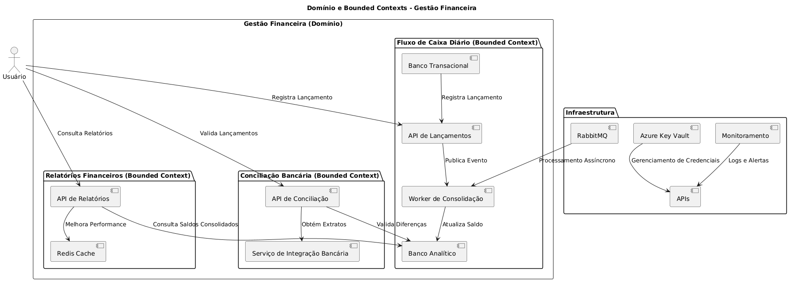
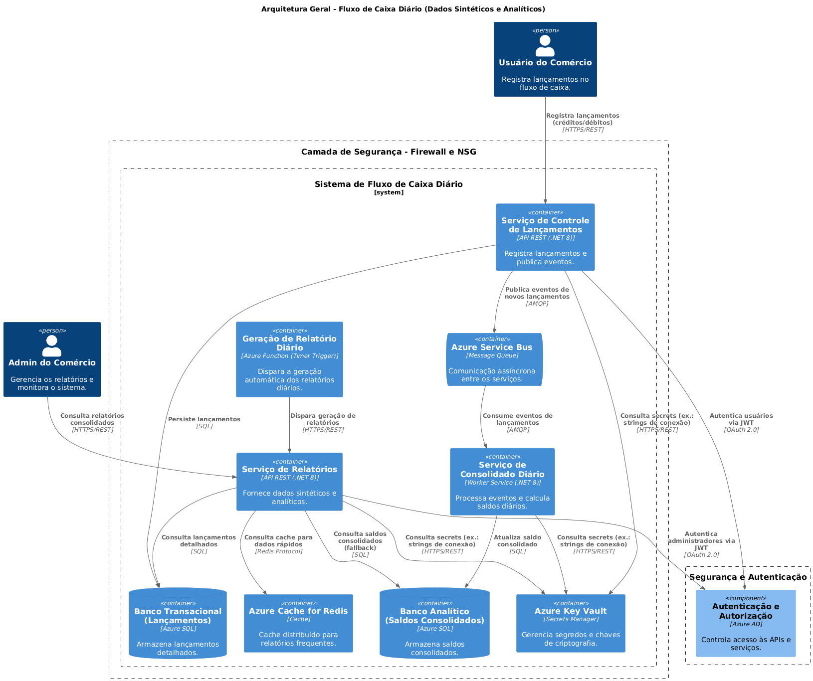

# 📌 Fluxo de Caixa Diário - Solução Arquitetural

## 🚨 Aviso

**Este projeto é uma Prova de Conceito (POC).**  
Ele foi desenvolvido para demonstração de conceitos arquiteturais, **não sendo solicitado ou pertencente ao trabalho de nenhuma empresa**.

---

## 📖 Índice
1. [Visão Geral](#1-visão-geral)
2. [Arquitetura da Solução](#2-arquitetura-da-solução)
3. [Monitoramento e Observabilidade](#3-monitoramento-e-observabilidade)
4. [Documentação Completa](#4-documentação-completa)
5. [Como Executar e Depurar](#5-como-executar-e-depurar)
6. [Observações Finais](#6-observações-finais)

---

## 1️⃣ **Visão Geral**

### 🎯 **Objetivo**
A solução permite gerenciar o **fluxo de caixa** de um pequeno comércio, oferecendo **registro de lançamentos**, **consolidação diária** e **relatórios financeiros**.

## 🏛 Mapeamento de Domínios e Capacidades de Negócio

A solução segue os princípios do **Domain-Driven Design (DDD)**, separando os domínios de Fluxo de Caixa, Relatórios e Infraestrutura.



[Plantuml](./docs/plantuml/dominio-bounded-contexts.plantuml)

### 📌 **Bounded Contexts - Gestão Financeira**
A modelagem da solução segue os princípios do **Domain-Driven Design (DDD)**, organizando os domínios e suas fronteiras.

🔹 **Domínio de Gestão Financeira**  
📌 Responsável por **controlar lançamentos financeiros, consolidar saldos e gerar relatórios**.  
- **Bounded Context de Fluxo de Caixa** → Gerencia os **lançamentos financeiros** e **saldo diário consolidado**.  
- **Bounded Context de Relatórios Financeiros** → Fornece acesso aos **saldos consolidados e exportação de dados**.  
- **Bounded Context de Conciliação Bancária** → Valida lançamentos comparando com **extratos bancários externos**.  

🔹 **Infraestrutura e Comunicação**  
📌 Responsável por **segurança, mensageria e caching**, garantindo resiliência e performance.  
- **RabbitMQ** → Comunicação assíncrona entre os contextos.  
- **Azure Key Vault** → Gerenciamento seguro de credenciais.  
- **Redis Cache** → Otimização das consultas de relatórios.  

📄 **Leia mais: [Mapeamento de Domínios e Capacidades de negócio](./docs/requisitos/MapeamentoDominios.md)**  

---

## 2️⃣ **Arquitetura da Solução**

A solução adota uma abordagem de **MicroServiços**, **CQRS**, **mensageria assíncrona** e **monitoramento avançado**.

### 🏛 **Diagrama da Arquitetura**

[Plantuml](./docs/plantuml/diagramasolucao.plantuml)

## 🔹 Principais Decisões Arquiteturais

A solução foi projetada para ser **modular, escalável e resiliente**, adotando padrões modernos e boas práticas.

### 🏗 **Decisões Arquiteturais Fundamentais**
✅ **Adoção da arquitetura de Microserviços**  
📄 [Leia mais: ADR-001 - Microserviços](./docs/adrs/ADR-001-Decisao-Adotar-Microservicos.md)

✅ **Separação entre Banco Transacional e Analítico**  
📄 [Leia mais: ADR-002 - Separação de Dados](./docs/adrs/ADR-002-Separacao-Dados-Transacional-e-Analitico.md)

✅ **Uso de Redis Cache para otimizar relatórios frequentes**  
📄 [Leia mais: ADR-003 - Uso de Redis Cache](./docs/adrs/ADR-003-Decisao-Sobre-Cache-Para-Relatorios-Diarios.md)

✅ **Uso de Azure Service Bus para comunicação assíncrona [Deprecated]**  
📄 [Leia mais: ADR-004 - Uso do Azure Sevice Bus](./docs/adrs/ADR-004-Decisao-Sobre-Azure-Service-Bus.md)

✅ **Adoção de Clean Architecture**  
📄 [Leia mais: ADR-005 - Clean Architecture](./docs/adrs/ADR-005-Decisao-Sobre-Adocao-CleanArchtecture.md)

✅ **Uso do RabbitMQ para comunicação assíncrona [ATUAL]**  
📄 [Leia mais: ADR-006 - Uso do RabbitMQ](./docs/adrs/ADR-006-Decisao-Usar-RabbitMQ.md)

---

## 3️⃣ **Monitoramento e Observabilidade**

A solução possui **logs estruturados, métricas e rastreamento distribuído** para garantir **visibilidade completa** da aplicação.

📌 **Ferramentas Utilizadas**:
✅ **Prometheus + Grafana** → Coleta e exibe métricas da aplicação.  
✅ **Serilog + Elasticsearch** → Armazena e analisa logs estruturados.  
✅ **OpenTelemetry + Jaeger** → Rastreia requisições distribuídas entre os serviços.  

📄 [Leia mais: Observabilidade e Logs](./docs/monitoramento/monitoramento-observabilidade.md)

---

## 4️⃣ **Documentação Completa**

📌 **Requisitos de Negócio e Técnicos**:
- [Documento de Requisitos](./docs/requisitos/documentorequisitos.md)  
- [Requisitos Não-Funcionais](./docs/requisitos/naofuncionais/requisitos-nao-funcionais.md)  

🔐 **Segurança**:
- [Arquitetura de Segurança](./docs/arquitetura/arquitetura-seguranca.md)  
- [Documento de Segurança](./docs/requisitos/naofuncionais/seguranca.md)  

🚀 **DevOps e Infraestrutura**:
- [DevOps e Deploy](./docs/devops/devops-deploy.md)  
- [Infraestrutura como Código (Terraform)](./docs/devops/Terraform.md)  
- [Setup Local](./docs/setup/setup-local.md)  

📊 **Monitoramento e Observabilidade**:
- [Observabilidade e Logs](./docs/monitoramento/monitoramento-observabilidade.md)  

---

## 5️⃣ **Como Executar e Depurar**

### ✅ **Pré-requisitos**
- **.NET 8 SDK** instalado.
- **Docker** para executar serviços dependentes (RabbitMQ, SQL, Redis, Prometheus, Grafana).
- **Git** para clonar o repositório.

### 🛠 **Passo a Passo**

1️⃣ **Clonar o Repositório**
```bash
git clone https://github.com/seu-usuario/fluxo-caixa-diario.git
cd fluxo-caixa-diario
```

2️⃣ **Subir os serviços no Docker**
```bash
docker-compose up -d
```

3️⃣ **Executar as aplicações**

📌 API de Controle de Lançamentos
```bash
cd src/ApiControleLancamentos
dotnet run
```

📌 Worker de Consolidação
```bash
cd src/WorkerConsolidado
dotnet run
```

📌 API de Relatórios
```bash
cd src/ApiRelatorios
dotnet run
```

Observação: Se preferir rodar todas as APIs simultaneamente no Visual Studio, pode abrir a solução .sln e rodar todas juntas.


4️⃣ **Verificar métricas**
```bash
http://localhost:5116/metrics
```
(Verifica se a API de Controle de Lançamentos está expondo métricas corretamente)

5️⃣ **Acessar Prometheus e Grafana**
- Prometheus → http://localhost:9090
(Ver métricas expostas pela aplicação)

- Grafana → http://localhost:3000 (Login: admin / admin)
(Painéis visuais de monitoramento das métricas)

6️⃣ **Depurar com Visual Studio**
- Definir ApiControleLancamentos, WorkerConsolidado e ApiRelatorios como projetos de inicialização.


## 6️⃣ Observações Finais
Esta documentação visa garantir que qualquer desenvolvedor consiga rodar, monitorar e debugar a aplicação Fluxo de Caixa Diário de maneira clara e eficiente.

✅ Passo a passo completo de execução e debug

✅ Arquitetura detalhada e decisões documentadas

✅ Monitoramento integrado com Grafana e Prometheus

Agora qualquer desenvolvedor pode executar a aplicação localmente e entender como cada componente funciona. 🚀🔥

