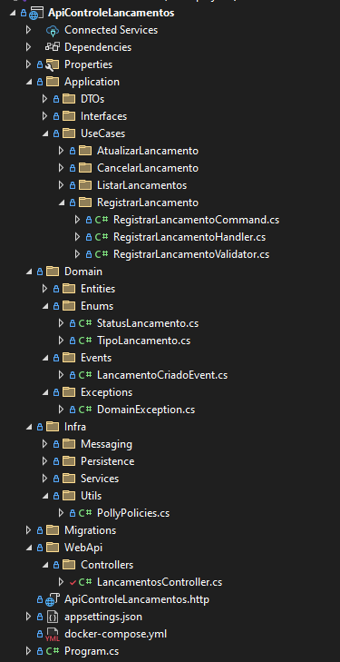

# 🏛 ADR-0005: Adoção da Clean Architecture

## 1️⃣ Contexto

A arquitetura de um sistema impacta diretamente sua **escalabilidade, testabilidade, separação de responsabilidades** e capacidade de evolução ao longo do tempo. No desenvolvimento do **Fluxo de Caixa Diário**, avaliamos três principais abordagens arquiteturais:

1. **Arquitetura em Camadas (Layered Architecture)**  
2. **Arquitetura Hexagonal (Ports & Adapters)**  
3. **Clean Architecture (Arquitetura Limpa)**  

Nosso objetivo era selecionar a melhor opção com base nos seguintes critérios:

✅ **Separação de responsabilidades** → Para evitar alto acoplamento.  
✅ **Facilidade de testes** → Para garantir cobertura e manutenção do código.  
✅ **Flexibilidade e independência de frameworks** → Para facilitar mudanças futuras.  
✅ **Escalabilidade e modularidade** → Para suportar crescimento do projeto.  

---

## 2️⃣ Alternativas Consideradas

### **🔹 Opção 1: Arquitetura em Camadas (Layered Architecture)**

🔍 **Descrição:**  
A arquitetura em camadas segue um modelo tradicional onde os componentes do sistema são divididos em camadas bem definidas, como:  

- **Apresentação (Presentation)**  
- **Aplicação (Application/Business Logic)**  
- **Infraestrutura (Persistence, External APIs, etc.)**  

🔍 **Vantagens:**  
✅ Simples de entender e implementar.  
✅ Bem documentada e usada amplamente na indústria.  
✅ Boa organização para sistemas pequenos ou monolíticos.  

🔍 **Desvantagens:**  
❌ **Acoplamento alto entre camadas**, dificultando mudanças na tecnologia.  
❌ **Dependência direta do banco de dados e frameworks externos**, reduzindo testabilidade.  
❌ **Dificuldade para escalar** modularmente sem reestruturar a arquitetura.  

---

### **🔹 Opção 2: Arquitetura Hexagonal (Ports & Adapters)**

🔍 **Descrição:**  
A Arquitetura Hexagonal propõe uma abordagem onde a **regra de negócio** é centralizada e interage com o mundo externo através de **Portas (Ports) e Adaptadores (Adapters)**.

🔍 **Vantagens:**  
✅ **Desacoplamento forte** entre domínio e infraestrutura.  
✅ **Facilidade para substituir tecnologias externas** (ex.: trocar banco de dados sem impacto no domínio).  
✅ **Testabilidade melhorada**, pois as regras de negócio são independentes da infraestrutura.  

🔍 **Desvantagens:**  
❌ **Curva de aprendizado mais alta**.  
❌ **Pode introduzir complexidade desnecessária** para projetos pequenos.  
❌ **Necessidade de configurar múltiplas interfaces e adaptadores**, aumentando o esforço de desenvolvimento.  

---

### **🔹 Opção 3: Clean Architecture (Arquitetura Limpa) - ESCOLHIDA ✅**

🔍 **Descrição:**  
A Clean Architecture, proposta por **Robert C. Martin (Uncle Bob)**, visa uma **organização modular e altamente desacoplada**. Ela se baseia em camadas concêntricas, onde:

- O **Domínio (Regras de Negócio) está no centro**, independente de infraestrutura.  
- A **Camada de Aplicação** gerencia os casos de uso.  
- A **Infraestrutura e Interface** são camadas externas, dependentes do núcleo.  

🔍 **Vantagens:**  
✅ **Independência de frameworks e banco de dados** → O código de negócio funciona sem precisar de tecnologias específicas.  
✅ **Alta testabilidade** → Como o Domínio e a Aplicação não dependem de infraestrutura, os testes são mais fáceis.  
✅ **Facilidade para escalar** → Com camadas bem definidas, novos serviços podem ser adicionados sem impactar o núcleo do sistema.  
✅ **Baixo acoplamento e modularidade** → Permite evolução do sistema sem grandes refatorações.  

🔍 **Desvantagens:**  
❌ **Maior curva de aprendizado inicial**, pois a separação de responsabilidades pode ser complexa para iniciantes.  
❌ **Pode ser excessivo para projetos extremamente pequenos**, onde a arquitetura em camadas poderia ser suficiente.  

---

## 3️⃣ Decisão

Após avaliar as três abordagens, decidimos adotar a **Clean Architecture** como a base para este projeto.  

📌 **Principais razões para a escolha:**  
✅ **Isolamento do domínio** → Permite manter as regras de negócio puras, sem dependência de infraestrutura.  
✅ **Fácil manutenção e evolução** → Mudanças em frameworks, banco de dados ou UI não afetam a lógica central.  
✅ **Testes unitários e integração mais eficazes** → O código é mais testável sem dependência de tecnologia.  
✅ **Escalabilidade** → A modularidade da Clean Architecture permite dividir responsabilidades e crescer de forma sustentável.  

---

## 4️⃣ Implementação no Projeto

O projeto foi organizado da seguinte forma, seguindo os princípios da **Clean Architecture**:

