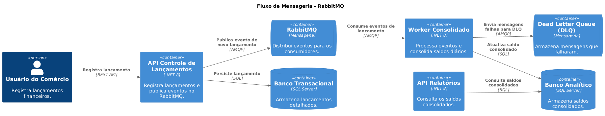

# ADR-007: Escolha do Worker Consolidado como um Worker Service

## 1️⃣ Contexto

O Worker Consolidado tem a responsabilidade de **processar mensagens de lançamentos financeiros** e calcular os **saldos consolidados diários**. Ele precisa lidar com **alta carga de requisições** (50 requisições por segundo) e garantir **resiliência e reprocessamento** de mensagens.

Duas abordagens foram consideradas:

1️⃣ **Worker Service em .NET 8 (atual)**  
2️⃣ **Azure Functions com Service Bus Trigger**  

Ambas as opções possuem vantagens e desvantagens.

---

## 2️⃣ Problema

Precisamos escolher **qual tecnologia utilizar** para processar as mensagens de forma assíncrona, garantindo **resiliência, escalabilidade e baixo custo**.

Os requisitos principais são:
- **Alta disponibilidade**: O Worker deve estar sempre disponível para processar mensagens.  
- **Escalabilidade**: Capacidade de aumentar a quantidade de processamento em momentos de pico.  
- **Resiliência**: Garantia de que as mensagens não sejam perdidas em caso de falhas temporárias.  
- **Baixa latência**: O processamento deve ser rápido para evitar gargalos.  
- **Custo eficiente**: Minimizar custos de infraestrutura.  

---

## 3️⃣ Decisão  

📌 **Decidimos manter o Worker Consolidado como um Worker Service em .NET 8, consumindo mensagens do RabbitMQ.**  

Essa decisão foi tomada com base nos seguintes fatores:

✅ **Menor latência**: O Worker roda continuamente, processando mensagens em tempo real.  
✅ **Maior controle**: Podemos gerenciar melhor **retry policies, logs e monitoramento**.  
✅ **Resiliência**: RabbitMQ já possui suporte a **DLQ (Dead Letter Queue)** para evitar perda de mensagens.  
✅ **Flexibilidade**: Pode rodar em **máquinas virtuais, Kubernetes ou Docker** sem dependência do Azure.  
✅ **Desempenho previsível**: Diferente do Azure Functions, que pode sofrer **cold start** se inativo.  
✅ **Integração nativa**: O Worker usa **MassTransit** e pode escalar horizontalmente quando necessário.  

📄 **Fluxo do Worker**:  

---

## 4️⃣ Alternativas Consideradas  

| Opção | Vantagens | Desvantagens |
|----------------|----------------------------------------------------------------|-------------------------------|
| **Worker Service (.NET 8) [ATUAL]** | ✅ Execução contínua sem latência adicional.   ✅ Controle sobre processamento e reprocessamento.   ✅ Funciona com RabbitMQ diretamente. | ❌ Precisa ser hospedado em um ambiente gerenciado (Docker/K8s). |
| **Azure Functions (Service Bus Trigger)** | ✅ Escalabilidade automática conforme a carga.   ✅ Custo reduzido se ociosidade for alta.   ✅ Fácil integração com outros serviços Azure. | ❌ Pode sofrer **cold start** quando inativo.   ❌ Exige troca de RabbitMQ por **Service Bus**.   ❌ Menor controle sobre **retry policies**. |

---

## 5️⃣ Consequências  

### **Positivas**  
✅ **Desempenho previsível** e **baixa latência** devido ao processamento contínuo.  
✅ **Resiliência garantida** com suporte a DLQ no RabbitMQ.  
✅ **Flexibilidade** para rodar **on-premises ou na nuvem**.  

### **Negativas**  
❌ **Necessidade de gerenciar infraestrutura** (Docker/K8s).  
❌ **Custo fixo** (diferente do Azure Functions, que só cobra quando processa mensagens).  

---

## 6️⃣ Revisões Futuras  

Se, no futuro, quisermos **reduzir custos e escalar automaticamente**, podemos reconsiderar o uso de **Azure Functions** com **Service Bus**.  

Critérios para revisão:
- Se **o custo de manter o Worker ativo for elevado**, podemos testar Azure Functions.  
- Se **a carga variar muito**, podemos explorar um modelo híbrido (Worker + Functions).  
- Se **o RabbitMQ for substituído pelo Azure Service Bus**, as Functions podem ser mais viáveis.  

---

## 7️⃣ Conclusão  

📌 **Mantemos o Worker Consolidado como um Worker Service em .NET 8**, pois ele oferece **desempenho mais estável, controle sobre reprocessamento e menor latência**.  

📄 **Leia mais**:  

- [Monitoramento e Observabilidade](../monitoramento/monitoramento-observabilidade.md)  
- [Requisitos Não-Funcionais](../requisitos/naofuncionais/requisitos-nao-funcionais.md)  
