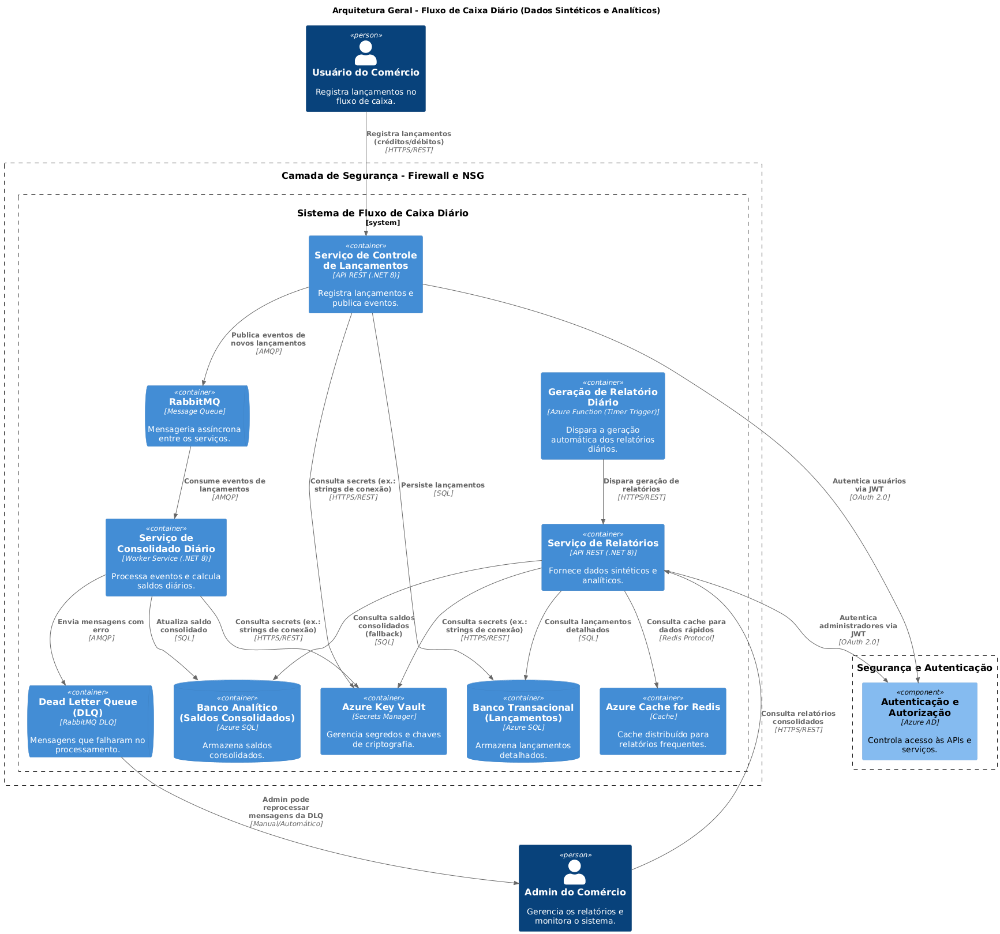

# 🏛 Arquitetura Geral - Fluxo de Caixa Diário  

## 1️⃣ Introdução  

Este documento descreve a **arquitetura da solução** para o **Fluxo de Caixa Diário**, detalhando **os serviços, bancos de dados, filas de mensageria e segurança**, bem como **os princípios e decisões arquiteturais adotadas**.

A solução foi projetada para ser **escalável, resiliente e segura**, permitindo a **gestão de lançamentos financeiros, processamento assíncrono e geração de relatórios consolidados**.

---

## 2️⃣ Visão Geral da Arquitetura  

A solução segue um modelo baseado em **Microserviços** e **CQRS (Command Query Responsibility Segregation)**, utilizando **RabbitMQ para comunicação assíncrona** e **Redis para otimização de consultas**.

📌 **Diagrama da Arquitetura Geral:**  

---

## 3️⃣ Componentes Principais  

### **📝 API de Controle de Lançamentos** (`ApiControleLancamentos`)  
📌 Responsável pelo registro de **créditos e débitos**.  
✅ Expondo uma **API REST** para interação com o usuário.  
✅ Persistindo os dados no **banco transacional**.  
✅ Publicando eventos de novos lançamentos no **RabbitMQ**.  

---

### **⚙️ Worker Consolidado** (`WorkerConsolidado`)  
📌 Responsável por **processar lançamentos e calcular o saldo diário**.  
✅ Consumindo mensagens de **novos lançamentos** do **RabbitMQ**.  
✅ Persistindo os **saldos diários** no **banco analítico**.  
✅ Encaminhando mensagens com erro para a **Dead Letter Queue (DLQ)**.  

---

### **📊 API de Relatórios** (`ApiRelatorios`)  
📌 Responsável por **fornecer dados consolidados e exportação de relatórios**.  
✅ Expondo uma **API REST** para consulta de lançamentos e saldos diários.  
✅ Utilizando **Redis Cache** para otimizar consultas frequentes.  
✅ Recuperando dados do **banco analítico (para consultas rápidas)** e **transacional (para detalhes)**.  

---

### **📂 Geração Automática de Relatórios** (`Azure Function`)  
📌 Responsável por **automatizar a geração de relatórios financeiros diários**.  
✅ Disparada via **Timer Trigger**.  
✅ Requisição à **API de Relatórios** para consolidar dados.  

---

## 4️⃣ Banco de Dados e Armazenamento  

| Componente                     | Finalidade |
|--------------------------------|--------------------------------|
| **Banco Transacional (SQL Server)** | Armazena lançamentos detalhados. |
| **Banco Analítico (SQL Server)** | Armazena os saldos consolidados, otimizando consultas. |
| **Redis Cache** | Reduz latência das consultas de relatórios frequentes. |
| **Azure Key Vault** | Armazena **credenciais e segredos** de forma segura. |

---

## 5️⃣ Mensageria e Comunicação  

A comunicação entre os serviços é **assíncrona**, utilizando **RabbitMQ** para desacoplar os componentes e garantir **resiliência**.

### 📌 **RabbitMQ - Comunicação Assíncrona**
📌 **Exemplo de Fluxo de Mensagens**:
1️⃣ **API de Controle de Lançamentos** publica um evento de novo lançamento no **RabbitMQ**.  
2️⃣ **Worker Consolidado** consome o evento e calcula o saldo diário.  
3️⃣ Caso haja falha no processamento, a mensagem é enviada para a **Dead Letter Queue (DLQ)** para reprocessamento.  

📌 **Diagrama:**  

### 📌 **Dead Letter Queue (DLQ)**
📌 **Objetivo:** Garantir que mensagens falhas não sejam perdidas.  
✅ Quando uma mensagem **não pode ser processada** pelo **Worker Consolidado**, ela é enviada para a **DLQ**.  
✅ O **Admin** pode **reprocessar** ou **investigar falhas manualmente**.  

---

## 6️⃣ Segurança e Autenticação  

A arquitetura adota **boas práticas de segurança**, garantindo que **apenas usuários autenticados e autorizados possam acessar os serviços**.

📌 **Principais mecanismos de segurança:**  

| Item                          | Implementação |
|-------------------------------|--------------|
| **Autenticação**              | OAuth 2.0 + OpenID Connect (Azure AD) |
| **Autorização**               | JWT Token baseado em permissões |
| **Segurança de Comunicação**  | TLS 1.2/1.3 obrigatório |
| **Armazenamento Seguro de Credenciais** | Azure Key Vault |
| **Criptografia de Dados**     | Transparent Data Encryption (TDE) |

📄 **Leia mais:** [Arquitetura de Segurança](./arquitetura-seguranca.md)

---

## 7️⃣ Escalabilidade e Resiliência  

A solução foi projetada para **escalar horizontalmente** e garantir **alta disponibilidade**.

### **✅ Escalabilidade**
📌 **APIs e Workers podem rodar em múltiplas instâncias**.  
📌 **RabbitMQ distribui mensagens entre múltiplos Workers** para balancear a carga.  
📌 **Redis Cache reduz a carga sobre o banco de dados** ao armazenar consultas frequentes.  

### **✅ Resiliência**
📌 **Dead Letter Queue (DLQ) evita perda de mensagens** em caso de falhas.  
📌 **Retry automático** para reprocessamento de falhas temporárias.  
📌 **Banco de dados com failover automático** para garantir continuidade do serviço.  

---

## 8️⃣ Monitoramento e Observabilidade  

A solução implementa **observabilidade completa**, permitindo **rastrear métricas, logs estruturados e rastreamento distribuído**.

| Ferramenta             | Finalidade |
|------------------------|-------------------------------------------|
| **Prometheus + Grafana** | Coleta e visualiza métricas de performance. |
| **Azure Application Insights** | Monitoramento de tempo de resposta e falhas. |
| **ELK Stack (Elasticsearch, Logstash, Kibana)** | Armazena e exibe logs estruturados. |
| **OpenTelemetry** | Rastreia chamadas distribuídas entre os serviços. |

📄 **Leia mais:** [Monitoramento e Observabilidade](../monitoramento/monitoramento-observabilidade.md)

---

## 9️⃣ Conclusão  

A arquitetura da solução **Fluxo de Caixa Diário** combina **boas práticas de design, mensageria assíncrona, observabilidade e segurança**, garantindo que o sistema seja **escalável, resiliente e preparado para produção**.

✅ **Próximos passos:**  
- 🔹 **Refinamento da API de Relatórios** para otimizar queries.  
- 🔹 **Configuração avançada de alertas e métricas** no Grafana.  
- 🔹 **Melhoria no processamento da DLQ** para reprocessamento automático.  

📄 **Referências complementares:**  
- [ADR-006: Decisão de Uso do RabbitMQ](../adrs/ADR-006-Decisao-Usar-RabbitMQ.md)  
- [Requisitos Não-Funcionais](../requisitos/naofuncionais/requisitos-nao-funcionais.md)  
- [DevOps e Deploy](../devops/devops-deploy.md)  
