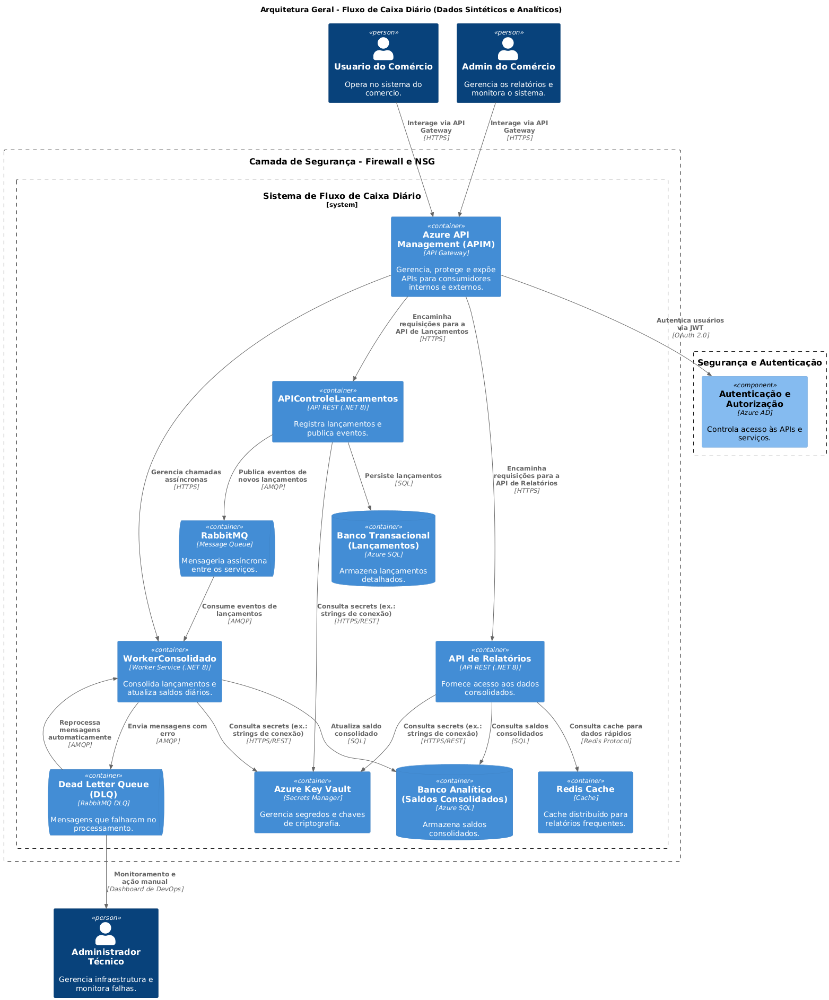
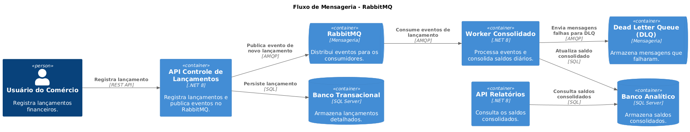

# 🏛 Arquitetura Geral - Fluxo de Caixa Diário  

## 1️⃣ Introdução  

Este documento descreve a **arquitetura da solução** para o **Fluxo de Caixa Diário**, detalhando **os serviços, bancos de dados, filas de mensageria e segurança**, bem como **os princípios e decisões arquiteturais adotadas**.

A solução foi projetada para ser **escalável, resiliente e segura**, permitindo a **gestão de lançamentos financeiros, processamento assíncrono e geração de relatórios consolidados**.

---

## 2️⃣ Visão Geral da Arquitetura  

A solução segue um modelo baseado em **Microserviços** e **CQRS (Command Query Responsibility Segregation)**, utilizando **RabbitMQ para comunicação assíncrona**, **Redis para otimização de consultas** e **Azure API Management (APIM) para expor APIs de forma segura e eficiente**.

📌 **Diagrama da Arquitetura Geral:**  

---

## 3️⃣ Componentes Principais  

### **🌐 Azure API Management (APIM)**  
📌 Camada de **exposição e gerenciamento** das APIs.  
✅ **Segurança** via **Azure AD e Rate Limiting**.  
✅ **Cache de respostas** para reduzir carga sobre as APIs.  
✅ **Logging centralizado** e rastreamento de requisições.  
✅ **Redirecionamento de tráfego** para diferentes versões das APIs.  

📝 **Leia mais:** [Documento de Requisitos APIM](../requisitos/APIM-Requisitos-arquiteturais.md)

---

### **📝 API de Controle de Lançamentos** (`ApiControleLancamentos`)  
📌 Responsável pelo registro de **créditos e débitos**.  
✅ Expondo uma **API REST** para interação com o usuário.  
✅ Persistindo os dados no **banco transacional**.  
✅ Publicando eventos de novos lançamentos no **RabbitMQ**.  

---

### **⚙️ Worker Consolidado** (`WorkerConsolidado`)  
📌 Responsável por **processar lançamentos e calcular o saldo diário**.  
✅ Consumindo mensagens de **novos lançamentos** do **RabbitMQ**.  
✅ Persistindo os **saldos diários** no **banco analítico**.  
✅ Encaminhando mensagens com erro para a **Dead Letter Queue (DLQ)**.  

---

### **📊 API de Relatórios** (`ApiRelatorios`)  
📌 Responsável por **fornecer dados consolidados e exportação de relatórios**.  
✅ Expondo uma **API REST** para consulta de lançamentos e saldos diários.  
✅ Utilizando **Redis Cache** para otimizar consultas frequentes.  
✅ Recuperando dados apenas do **banco analítico**.  

---

## 4️⃣ Banco de Dados e Armazenamento  

| Componente                     | Finalidade |
|--------------------------------|--------------------------------|
| **Banco Transacional (SQL Server)** | Armazena lançamentos detalhados. |
| **Banco Analítico (SQL Server)** | Armazena os saldos consolidados, otimizando consultas. |
| **Redis Cache** | Reduz latência das consultas de relatórios frequentes. |
| **Azure Key Vault** | Armazena **credenciais e segredos** de forma segura. |

---

## 5️⃣ Mensageria e Comunicação  

A comunicação entre os serviços é **assíncrona**, utilizando **RabbitMQ** para desacoplar os componentes e garantir **resiliência**.

📌 **Exemplo de Fluxo de Mensagens**:

1️⃣ **API de Controle de Lançamentos** publica um evento de novo lançamento no **RabbitMQ**.  
2️⃣ **Worker Consolidado** consome o evento e calcula o saldo diário.  
3️⃣ Caso haja falha no processamento, a mensagem é enviada para a **Dead Letter Queue (DLQ)** para reprocessamento.  

📌 **Diagrama:**  

---

## 6️⃣ Segurança e Autenticação  

A arquitetura adota **boas práticas de segurança**, garantindo que **apenas usuários autenticados e autorizados possam acessar os serviços**.

📌 **Principais mecanismos de segurança:**  

| Item                          | Implementação |
|-------------------------------|--------------|
| **Autenticação**              | OAuth 2.0 + OpenID Connect (Azure AD) |
| **Autorização**               | JWT Token baseado em permissões |
| **Segurança de Comunicação**  | TLS 1.2/1.3 obrigatório |
| **Armazenamento Seguro de Credenciais** | Azure Key Vault |
| **Proteção contra ataques**   | Rate Limiting no APIM |
| **Criptografia de Dados**     | Transparent Data Encryption (TDE) |

📄 **Leia mais:** [Arquitetura de Segurança](./arquitetura-seguranca.md)

---

## 7️⃣ Escalabilidade e Resiliência  

A solução foi projetada para **escalar horizontalmente** e garantir **alta disponibilidade**.

### **✅ Escalabilidade**
📌 **APIs e Workers podem rodar em múltiplas instâncias**.  
📌 **RabbitMQ distribui mensagens entre múltiplos Workers** para balancear a carga.  
📌 **Redis Cache reduz a carga sobre o banco de dados** ao armazenar consultas frequentes.  
📌 **Azure API Management (APIM) gerencia requisições e aplica caching inteligente**.  

### **✅ Resiliência**
📌 **Dead Letter Queue (DLQ) evita perda de mensagens** em caso de falhas.  
📌 **Retry automático** para reprocessamento de falhas temporárias.  
📌 **Banco de dados com failover automático** para garantir continuidade do serviço.  

---

## 8️⃣ Monitoramento e Observabilidade  

A solução implementa **observabilidade completa**, permitindo **rastrear métricas, logs estruturados e rastreamento distribuído**.

| Ferramenta             | Finalidade |
|------------------------|-------------------------------------------|
| **Azure API Management Logs** | Monitoramento centralizado das APIs. |
| **Prometheus + Grafana** | Coleta e visualiza métricas de performance. |
| **Azure Application Insights** | Monitoramento de tempo de resposta e falhas. |
| **OpenTelemetry** | Rastreia chamadas distribuídas entre os serviços. |

📄 **Leia mais:** [Monitoramento e Observabilidade](../monitoramento/monitoramento-observabilidade.md)

---

## 9️⃣ Conclusão  

A arquitetura da solução **Fluxo de Caixa Diário** combina **boas práticas de design, mensageria assíncrona, observabilidade e segurança**, garantindo que o sistema seja **escalável, resiliente e preparado para produção**.

✅ **Principais melhorias com APIM**:  
- **Maior segurança e controle sobre APIs** (OAuth 2.0, Rate Limiting).  
- **Gerenciamento centralizado das APIs** (Monitoramento, Versionamento).  
- **Redução da carga nas APIs** (Caching de respostas).  

📄 **Referências complementares:**  
- [ADR-006: Decisão de Uso do RabbitMQ](../adrs/ADR-006-Decisao-Usar-RabbitMQ.md)  
- [ADR-009: Decisão de Uso do Azure API Management](../adrs/ADR-009-Decisao-Sobre-Uso-APIM.md)  
- [Requisitos Não-Funcionais](../requisitos/naofuncionais/requisitos-nao-funcionais.md)  
- [DevOps e Deploy](../devops/devops-deploy.md)  
